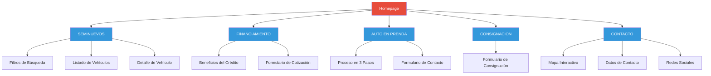
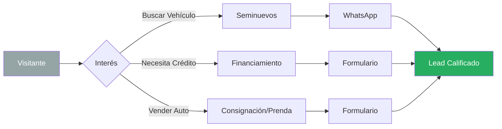

# Análisis Completo: www.queirolo.cl
## Análisis de Estructura Web para Referencia de Nuevo Desarrollo

**Fecha de Análisis:** 13 de enero de 2026  
**Sitio Analizado:** [www.queirolo.cl](https://www.queirolo.cl)  
**Empresa:** Queirolo Mundo 4x4  
**Rubro:** Venta de vehículos seminuevos, financiamiento y consignaciones

---

## 📋 Resumen Ejecutivo

Queirolo Mundo 4x4 opera un sitio web funcional enfocado en la **captación de leads** a través de múltiples formularios de contacto y un canal directo de WhatsApp. El sitio presenta una estructura clara y lineal, con énfasis en servicios de venta de vehículos seminuevos, financiamiento, compra de autos en prenda y consignaciones.

**Fortalezas identificadas:**
- Estructura de navegación clara y directa
- Múltiples puntos de conversión (formularios + WhatsApp)
- Catálogo de vehículos con sistema de filtros
- Integración con mapas para ubicación física

**Oportunidades de mejora:**
- Diseño visual que requiere modernización
- Experiencia de usuario mejorable en dispositivos móviles
- Falta de contenido multimedia dinámico (videos, 360°)
- Optimización de velocidad de carga

---

## 🏗️ Estructura de Navegación

### Menú Principal

El sitio cuenta con 6 secciones principales en el header:

| Sección | Descripción | Objetivo Principal |
|---------|-------------|-------------------|
| **INICIO** | Página de aterrizaje con slider hero y servicios destacados | Presentación general y primeras impresiones |
| **SEMINUEVOS** | Catálogo completo de vehículos con filtros avanzados | Búsqueda y selección de vehículos |
| **FINANCIAMIENTO** | Información de créditos y simulador | Captación de leads financieros |
| **AUTO EN PRENDA** | Servicio de compra de vehículos con deuda | Captación de vendedores con deuda |
| **CONSIGNACION** | Formulario para ofrecer vehículos en consignación | Captación de inventario |
| **CONTACTO** | Ubicación, teléfonos, horarios y redes sociales | Información de contacto directo |

### Arquitectura de Información



---

## 📸 Análisis Visual por Secciones

### 1. Homepage - Hero Section


**Elementos clave:**
- **Logo corporativo:** Ubicado en esquina superior izquierda, diseño en rojo y negro
- **Slider hero:** Imágenes de alta calidad de vehículos 4x4 con overlay de texto
- **Llamados a la acción:** Botones circulares para "VENTA DE VEHÍCULOS", "COMPRAMOS TU AUTO", "CONSIGNACIONES", "CRÉDITOS"
- **Sección de vehículos destacados:** Galería con etiquetas "RECIÉN LLEGADO"
- **Botón flotante de WhatsApp:** Presente en todas las páginas (verde, esquina inferior derecha)

**Observaciones de diseño:**
- Paleta de colores: Rojo (#e74c3c), negro, blanco
- Layout: Contenedor fijo (boxed), no full-width
- Tipografía: Sans-serif estándar, legible pero no premium

---

### 2. Seminuevos - Catálogo de Vehículos


**Funcionalidades:**
- **Filtros de búsqueda avanzados:**
  - Tipo de vehículo
  - Marca
  - Modelo
  - Año desde/hasta
  - Precio hasta
  - Transmisión
  - Combustible
  - Sucursal

- **Listado de vehículos:**
  - 25 vehículos en venta (al momento del análisis)
  - Cards con imagen, nombre del modelo y etiqueta "RECIÉN LLEGADO"
  - Diseño en grid de 3 columnas

**Observaciones técnicas:**
- Sistema de gestión de inventario integrado
- Filtros probablemente con recarga de página (no AJAX instantáneo)
- Imágenes de vehículos en showroom con fondo verde (branding consistente)

---

### 3. Financiamiento - Crédito Directo


**Propuesta de valor:**
- **"TU CRÉDITO DIRECTO INMEDIATO"**
- **Llamado a la acción principal:** "COTIZA CON NOSOTROS AL WHATSAPP (+56) 9 72149979"

**Beneficios destacados:**
1. **SIN DEUDA:** No queda registrada en sistema financiero
2. **ENTREGA INMEDIATA:** Crédito firmado de inmediato en Queirolo Mundo 4x4
3. **AUTO ASEGURADO:** Opción de seguro en las cuotas

**Formulario de cotización:**
- Sección 1: Datos Personales (Nombre, RUT, Email, Teléfono, Comuna)
- Sección 2: Datos Vehículo (Marca, Modelo, Año, Patente)
- Sección 3: Datos Crédito (Monto, Pie, Cuotas)

**Observación:** El formulario es estático, no hay simulador en tiempo real que calcule cuotas automáticamente.

---

### 4. Footer y Ubicación


**Información de contacto:**
- **Dirección:** Av. Las Condes 12461, Local 4A, Las Condes, Santiago - Chile
- **Teléfonos:** 
  - (+56 9) 7214-9979
  - (+56 2) 4367-0362
- **Horarios:**
  - Lunes a Viernes: 09:30 - 18:00
  - Sábado: Previa Cita
- **Redes Sociales:** Instagram (icono visible)

**Mapa interactivo:**
- Integración con Leaflet (OpenStreetMap)
- Pin de ubicación exacta del local
- Controles de zoom funcionales

---

## 🎨 Análisis de Diseño Visual

### Paleta de Colores

| Color | Hex | Uso |
|-------|-----|-----|
| Rojo corporativo | `#e74c3c` | Logo, botones principales, acentos |
| Negro | `#000000` | Texto, fondos de secciones |
| Blanco | `#ffffff` | Fondos, texto sobre negro |
| Gris oscuro | `#2c3e50` | Fondos secundarios |

### Tipografía

- **Familia principal:** Sans-serif estándar (probablemente Arial o Helvetica)
- **Jerarquía:** Clara pero básica
- **Legibilidad:** Buena, aunque podría mejorarse con tipografías modernas

### Layout y Espaciado

- **Contenedor:** Boxed (ancho fijo, no full-width)
- **Grid:** Sistema de columnas tradicional
- **Espaciado:** Moderado, algunas secciones se sienten densas
- **Responsive:** Sí, pero con oportunidades de mejora en móvil

---

## 🔧 Análisis Técnico

### Stack Tecnológico Observado

- **Frontend:** HTML, CSS, JavaScript
- **Mapa:** Leaflet (OpenStreetMap)
- **Imágenes:** JPG/PNG optimizadas para web
- **CMS:** Probablemente un sistema personalizado o CMS ligero para gestión de inventario

### Rendimiento

> [!NOTE]
> Observaciones de velocidad de carga

- **Tiempo de carga inicial:** Aceptable (~2-3 segundos)
- **Imágenes:** Múltiples imágenes de vehículos podrían optimizarse (lazy loading)
- **JavaScript:** Carga sincrónica, podría mejorarse con async/defer
- **CSS:** No se observa minificación agresiva

### SEO y Accesibilidad

**Puntos positivos:**
- Estructura HTML semántica básica
- Meta tags presentes (título, descripción)
- URLs limpias y descriptivas

**Oportunidades de mejora:**
- Alt text en imágenes podría ser más descriptivo
- Heading hierarchy (H1, H2, H3) mejorable
- Schema markup para vehículos no implementado
- Velocidad de carga optimizable

---

## 💡 Estrategia de Conversión

### Canales de Captación de Leads

1. **WhatsApp (Principal):**
   - Botón flotante omnipresente
   - Número: (+56) 9 72149979
   - Presente en todas las páginas

2. **Formularios de Contacto:**
   - Financiamiento: Cotización de crédito
   - Consignación: Oferta de vehículo
   - Auto en Prenda: Solicitud de compra

3. **Teléfono Directo:**
   - (+56 2) 4367-0362
   - Visible en header y footer

4. **Redes Sociales:**
   - Instagram (enlace en footer)

### Embudo de Conversión



---

## 🚀 Propuestas de Modernización

### 1. Diseño Visual y UX

> [!IMPORTANT]
> Prioridad Alta - Impacto directo en primera impresión

#### Recomendaciones:

**Paleta de colores moderna:**
- Mantener rojo corporativo pero con tonos más sofisticados
- Incorporar gradientes sutiles
- Implementar modo oscuro opcional
- Ejemplo de paleta mejorada:
  - Rojo principal: `#e74c3c` → `#e63946`
  - Rojo oscuro: `#c0392b` → `#d62828`
  - Gris moderno: `#2c3e50` → `#1d3557`
  - Acento: `#f1faee` (crema claro)

**Tipografía premium:**
```css
/* Ejemplo de stack tipográfico moderno */
font-family: 'Inter', 'Roboto', 'Outfit', -apple-system, BlinkMacSystemFont, sans-serif;
```

**Layout full-width:**
- Eliminar contenedor boxed
- Implementar secciones full-width con contenido centrado
- Mejorar espaciado vertical (más "aire")

**Micro-animaciones:**
- Hover effects en cards de vehículos
- Transiciones suaves en navegación
- Scroll animations para secciones
- Loading states elegantes

---

### 2. Experiencia Móvil (Mobile-First)

> [!WARNING]
> El tráfico móvil representa >60% en sitios automotrices

#### Mejoras específicas:

**Navegación móvil:**
- Menú hamburguesa más intuitivo
- Botones de acción más grandes (mínimo 44x44px)
- Sticky header con CTA de WhatsApp

**Formularios móviles:**
- Inputs optimizados para teclados móviles
- Validación en tiempo real
- Autocompletado inteligente
- Botones de envío destacados

**Imágenes responsivas:**
```html
<!-- Ejemplo de implementación -->
<picture>
  <source media="(max-width: 768px)" srcset="vehiculo-mobile.webp">
  <source media="(min-width: 769px)" srcset="vehiculo-desktop.webp">
  
</picture>
```

---

### 3. Catálogo de Vehículos Mejorado

> [!TIP]
> La visualización de productos es crítica en e-commerce automotriz

#### Funcionalidades sugeridas:

**Visualización 360°:**
- Implementar visor 360° para cada vehículo
- Galería de imágenes ampliable (lightbox)
- Zoom de alta calidad en detalles

**Filtros inteligentes:**
- Búsqueda con AJAX (sin recargar página)
- Sugerencias automáticas mientras se escribe
- Filtros guardados en localStorage
- Comparador de vehículos (hasta 3)

**Ficha técnica completa:**
- Especificaciones detalladas
- Historial de mantenimiento (si aplica)
- Certificación de revisión técnica
- Calculadora de cuotas integrada

**Ejemplo de estructura de card mejorada:**

```html
<div class="vehicle-card">
  <div class="vehicle-image">
    
    <span class="badge new">RECIÉN LLEGADO</span>
    <button class="btn-360">Ver 360°</button>
  </div>
  <div class="vehicle-info">
    <h3>BMW X3 XDRIVE28I 2.0 AUT</h3>
    <div class="vehicle-specs">
      <span>2018</span>
      <span>45.000 km</span>
      <span>Automático</span>
    </div>
    <div class="vehicle-price">
      <span class="price">$18.990.000</span>
      <span class="installment">o desde $350.000/mes</span>
    </div>
    <div class="vehicle-actions">
      <button class="btn-primary">Ver Detalles</button>
      <button class="btn-whatsapp">Consultar por WhatsApp</button>
    </div>
  </div>
</div>
```

---

### 4. Simulador de Crédito en Tiempo Real

> [!IMPORTANT]
> Aumenta conversión al dar respuestas inmediatas

#### Implementación sugerida:

**Calculadora interactiva:**
```javascript
// Ejemplo de lógica de simulador
function calcularCuota(monto, pie, cuotas, tasaAnual = 12) {
  const montoFinanciar = monto - pie;
  const tasaMensual = tasaAnual / 12 / 100;
  const cuotaMensual = montoFinanciar * (tasaMensual * Math.pow(1 + tasaMensual, cuotas)) / 
                       (Math.pow(1 + tasaMensual, cuotas) - 1);
  return Math.round(cuotaMensual);
}
```

**Características:**
- Sliders interactivos para monto, pie y plazo
- Resultado instantáneo al mover sliders
- Gráfico de amortización
- Comparación de diferentes escenarios
- Botón "Solicitar este crédito" que pre-llena formulario

---

### 5. Contenido Multimedia

> [!TIP]
> El video aumenta el engagement y tiempo en sitio

#### Contenido sugerido:

**Videos:**
- Tour virtual del showroom
- Reseñas de vehículos destacados
- Testimonios de clientes
- Proceso de compra paso a paso

**Fotografía profesional:**
- Sesiones en exteriores (no solo showroom)
- Detalles de interiores en alta resolución
- Vistas de motor y baúl
- Comparativas de tamaño

**Contenido generado por usuarios:**
- Reseñas con fotos de clientes
- Historias de Instagram embebidas
- Galería de "Nuestros clientes felices"

---

### 6. Optimización Técnica

> [!CAUTION]
> La velocidad afecta directamente el SEO y conversión

#### Mejoras de rendimiento:

**Imágenes:**
- Formato WebP con fallback a JPG
- Lazy loading nativo: ``
- Responsive images con `srcset`
- CDN para assets estáticos

**JavaScript:**
```html
<!-- Carga asíncrona de scripts no críticos -->
<script src="analytics.js" async></script>
<script src="chat-widget.js" defer></script>
```

**CSS:**
- Critical CSS inline en `<head>`
- CSS no crítico cargado de forma asíncrona
- Minificación y compresión (Gzip/Brotli)

**Caché:**
```nginx
# Ejemplo de configuración Nginx
location ~* \.(jpg|jpeg|png|gif|ico|css|js|webp)$ {
    expires 1y;
    add_header Cache-Control "public, immutable";
}
```

---

### 7. SEO Avanzado

#### Schema Markup para vehículos:

```json
{
  "@context": "https://schema.org/",
  "@type": "Car",
  "name": "BMW X3 XDRIVE28I 2.0 AUT",
  "brand": {
    "@type": "Brand",
    "name": "BMW"
  },
  "model": "X3 XDRIVE28I",
  "vehicleModelDate": "2018",
  "mileageFromOdometer": {
    "@type": "QuantitativeValue",
    "value": "45000",
    "unitCode": "KMT"
  },
  "offers": {
    "@type": "Offer",
    "price": "18990000",
    "priceCurrency": "CLP",
    "availability": "https://schema.org/InStock"
  }
}
```

#### Meta tags optimizados:

```html
<title>BMW X3 2018 - 45.000km | Queirolo Mundo 4x4</title>
<meta name="description" content="BMW X3 XDRIVE28I 2.0 AUT 2018, 45.000km. Financiamiento directo. Showroom en Las Condes. ¡Consulta por WhatsApp!">
<meta property="og:image" content="https://queirolo.cl/images/bmw-x3-2018.jpg">
```

---

## 📊 Comparativa: Actual vs. Propuesto

| Aspecto | Situación Actual | Propuesta Moderna |
|---------|------------------|-------------------|
| **Diseño** | Boxed, colores básicos | Full-width, gradientes, modo oscuro |
| **Tipografía** | Sans-serif estándar | Inter/Outfit con jerarquía clara |
| **Navegación móvil** | Funcional pero básica | Optimizada mobile-first, gestos intuitivos |
| **Catálogo** | Grid simple con filtros | Filtros AJAX, comparador, vistas 360° |
| **Financiamiento** | Formulario estático | Simulador en tiempo real con gráficos |
| **Multimedia** | Solo imágenes estáticas | Videos, 360°, testimonios |
| **Velocidad** | ~3s carga inicial | <1.5s con lazy loading y WebP |
| **SEO** | Básico | Schema markup, meta tags optimizados |
| **Conversión** | WhatsApp + formularios | + Chat en vivo, + Comparador, + Simulador |

---

## 🎯 Roadmap de Implementación Sugerido

### Fase 1: Fundamentos (Semanas 1-2)
- [ ] Rediseño visual (paleta, tipografía, layout)
- [ ] Optimización mobile-first
- [ ] Implementación de lazy loading
- [ ] Migración a WebP

### Fase 2: Funcionalidades Core (Semanas 3-4)
- [ ] Catálogo mejorado con filtros AJAX
- [ ] Simulador de crédito en tiempo real
- [ ] Galería de imágenes ampliable
- [ ] Formularios optimizados

### Fase 3: Contenido Avanzado (Semanas 5-6)
- [ ] Integración de videos
- [ ] Visor 360° de vehículos
- [ ] Sección de testimonios
- [ ] Blog/Noticias automotrices

### Fase 4: Optimización y Analytics (Semanas 7-8)
- [ ] SEO técnico completo
- [ ] Schema markup
- [ ] Google Analytics 4
- [ ] Heatmaps y grabaciones de sesión
- [ ] A/B testing de CTAs

---

## 📁 Recursos de Referencia

### Screenshots Capturados

Todos los screenshots están disponibles en la carpeta de artifacts:

1. [Homepage Hero](file:///C:/Users/denny/.gemini/antigravity/brain/7e432907-8504-4d32-9190-be71d34300d2/homepage_hero_1768342797584.png)
2. [Seminuevos - Catálogo](file:///C:/Users/denny/.gemini/antigravity/brain/7e432907-8504-4d32-9190-be71d34300d2/seminuevos_page_1768342923050.png)
3. [Financiamiento](file:///C:/Users/denny/.gemini/antigravity/brain/7e432907-8504-4d32-9190-be71d34300d2/financiamiento_page_1768342976548.png)
4. [Auto en Prenda](file:///C:/Users/denny/.gemini/antigravity/brain/7e432907-8504-4d32-9190-be71d34300d2/auto_en_prenda_page_1768343045854.png)
5. [Consignación](file:///C:/Users/denny/.gemini/antigravity/brain/7e432907-8504-4d32-9190-be71d34300d2/consignacion_page_1768343126571.png)
6. [Footer y Mapa](file:///C:/Users/denny/.gemini/antigravity/brain/7e432907-8504-4d32-9190-be71d34300d2/footer_and_map_1768343406135.png)

### Video de Navegación Completa


---

## 🔍 Conclusiones

### Fortalezas del Sitio Actual

1. **Claridad de propuesta de valor:** Es inmediatamente claro qué hace la empresa
2. **Múltiples canales de conversión:** WhatsApp omnipresente + formularios estratégicos
3. **Estructura lógica:** Navegación intuitiva y bien organizada
4. **Funcionalidad completa:** Todas las secciones críticas están presentes

### Áreas de Oportunidad Críticas

1. **Modernización visual:** El diseño se siente desactualizado comparado con competidores premium
2. **Experiencia móvil:** Mejorable en términos de usabilidad táctil
3. **Interactividad:** Falta de elementos dinámicos que generen engagement
4. **Velocidad:** Optimización de assets para mejorar Core Web Vitals

### Recomendación Final

> [!IMPORTANT]
> Priorizar una experiencia premium y moderna que refleje la calidad de los vehículos

Para la nueva página web de Queirolo, se recomienda:

1. **Mantener** la estructura de navegación clara y los múltiples puntos de conversión
2. **Modernizar** completamente el diseño visual con paleta sofisticada y tipografía premium
3. **Implementar** funcionalidades interactivas (simulador, 360°, comparador)
4. **Optimizar** para móvil con enfoque mobile-first
5. **Acelerar** la velocidad de carga con técnicas modernas (WebP, lazy loading, CDN)
6. **Enriquecer** con contenido multimedia (videos, testimonios)

El objetivo debe ser crear una experiencia que transmita **confianza, profesionalismo y modernidad**, alineada con las expectativas de clientes que buscan vehículos premium en el segmento 4x4.

---

**Documento generado por:** Análisis automatizado con Playwright  
**Fecha:** 13 de enero de 2026  
**Versión:** 1.0
